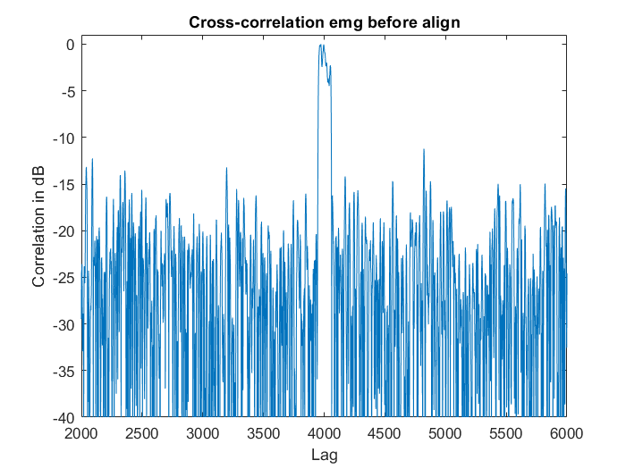
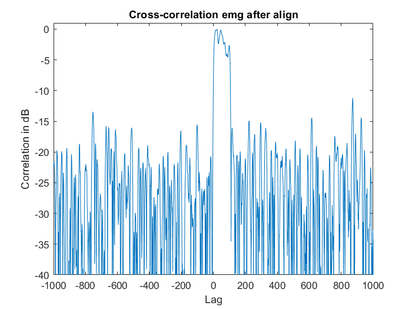
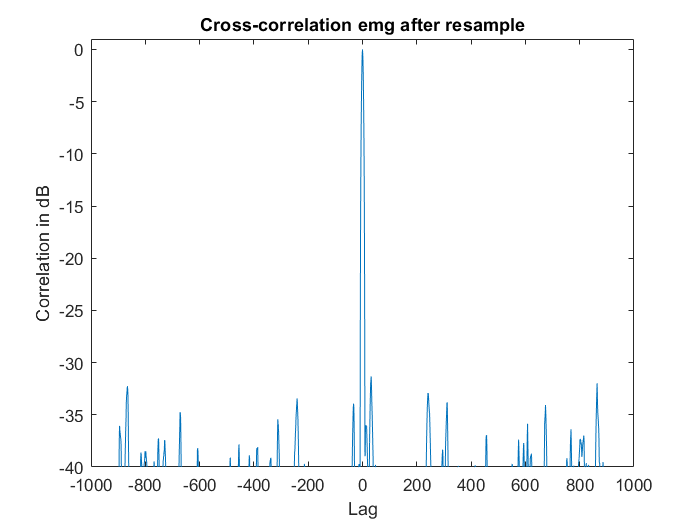
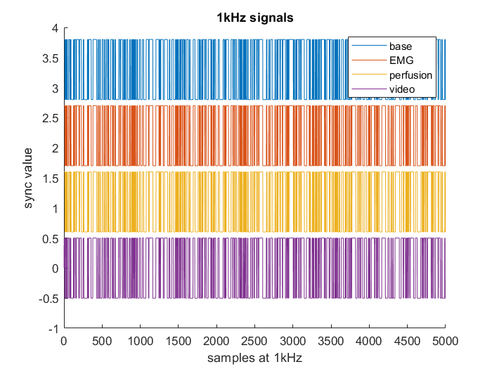
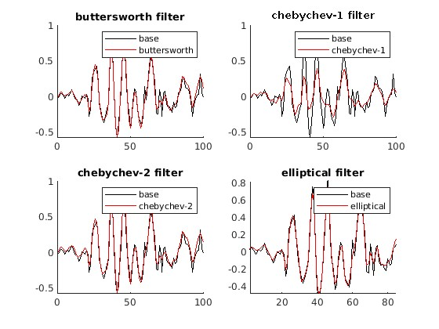
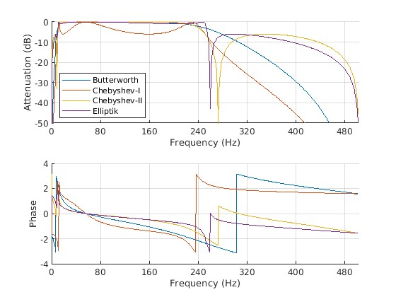
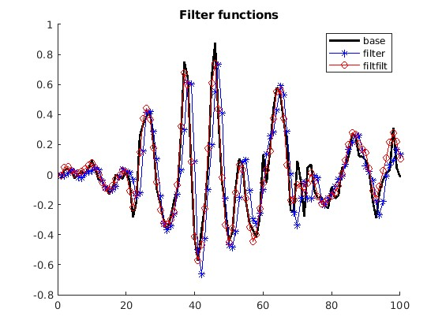
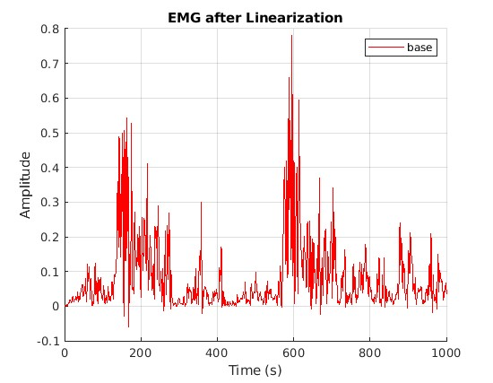

# How to use
Please install Signal Processing Toolbox before useing our GUI.
Executable is compiled on a Windows 10 pc.

# Documentation code
## Wrong EMG signal sample frequency.
In the given dataset, the EMG signal was sampled at 1kHz. But in practice this sample rate was not 1kHz.

We can observe from the correlation graph below that the EMG signals correlates on to many places with the pseudo random sync signal.

We came up with a way to extract the correct sample frequency from the EMG signal based on the base signal. These are the steps we took:
1. We resample the signals gien to 1kHz
2. Match the beginning of the 2 signals and cut everything before off. So we make the signals causale.
3. Do the same at the end of the signal where we cut off everything that comes after this.

> In both 2 and 3 we work with a frame size (of 5001) so the correlation is less computationally heavy because 
when we correlate a signal with 20000 points, this gives us 40000 points to process. We took 5001 because the lagg was situated around 4000 samples difference with the base signal. The +1 is to create even symmetry.

Below, the cross correlation where we see that the correlation spread is now arround the center (0) so this means that the signals are aligned at the beginnin and at the end.

4. The signals now start and stop at the same place. Because EMG is sampled at a different rate then the base signal, 
means that the EMG signal can have more points (sampled at a higher rate then 1kHz) or less points (sampled at a lower rate then 1kHz).

> from the used dataset, the EMG samples where lower in number then the base samples. This means that the EMG signal is sampled at a lower rate then 1kHz.

5. Based on this points, we can create the resample factor by dividing the amount of samples of the EMG by the amount of samples of the base signal.
We use the matklab <code> rat </code> function to give us 2 integer numbers. 

> We can also multiply this ratio with the current base sample rate on 1kHz to get the real 
sample frequency of the EMG signal. In our case, we came up with a sample rate of 999.355039Hz

6. We check once more the full correlation of the EMG signal with the bas.

## Aligning the data based on the pseudo random signal

When we found each sample frequency, we can continue with resampling the signals to 1kHz.

The steps we've taken:

1. Resample everything from the beginning with the new accuired sample rate.

2. Align all signals (this is for the base signal, perfusion, EMG and video capture) so that they start at 1 position in time (causale). To align, we do not alter the base sync signal. So if a signal starts behind the sync signal, we add zeros to the orther signal. If a signal start upfront, we delete samples of the other signal until the match is there.

3. From this align method, we receive a lag value. This lagg value is used to determine the beginning of all signals. So the maximum is used here. We cut everything off before the beginning to make the signals (and data) start at the same time.

4. When aligned propperly, we seek for the lowes number of samples in the 4 signals and curt everything off at the lowes number of samples. With this, we make sure that our signals start and stop at the same time.

> We align only the pseudo random signal and keep track of the indexes that where removed. Thus, we know which sync sample corresponds to which datapoint at the end.

As can be observed, all the noise arround is gone and we have a single point of correlation which means the sample rates are equal.

When observing a portion of the synchronization values, we see that they are aligned.

## EMG data smoother (or filter)
To smoothen the EMG data the following step were applied:
  1) Digital to analog data (**EMG_to_mV**)
The EMG sensor works on a 3.3V operating voltage with a gain of around 1000. This means that the amplitude original signal must sway between -1.65mV & 1.65mV. Due to it being a sensor, the data is stored in a digital format using 12-bits.

To get the real signal we must convert the measured data via the following formula:
$`EMG(mV)=(ADC/(2^n)-1/2)*(V_CC)/(G_EMG)*1000`$
The formula can be fount in [this datasheet](https://support.pluxbiosignals.com/wp-content/uploads/2021/11/revolution-emg-sensor-datasheet-1.pdf)

The matlab-function [**EMG_to_mV**](./OTHER/Tom/EMG_to_mV.m) is provided for this functionality.
  - INPUT:  - emg_data: The EMG data in 12-bit format
  - OUPTUT: - mV_data:  The EMG data in milli-Volts

  2) Filter the frequency range (**EMG_filter**)
The sensor has a bandwidth of 500Hz. The following [article](https://www.nature.com/articles/s41598-023-33319-4) specifies that the Power spectrum of the EMG data is mostly within the 10-250Hz range. This means that we can apply a bandpass filter to remove the noise.

The following filters where applied to the EMG sample data to find the most efficient filter:
  - Buttersworth filter
  - Chebishev-I filter
  - Chebishev-II filter
  - Eliptical filter

As seen in the graphs only the Chebishev-I filter has largely unwanted effects. The bode plots of these filters will be needed to decide which filter will be applied.

As seen in the magnitude plot:
  - The Buttersworth filter is stable in the wanted bandwidth, but starts attenuating before 250Hz and has a slow decent.
  - The Chebishev-I filter is unstable in the wanted bandwidth and starts drastically attenuating before 250Hz, though it has a sharp decent.
  - The Chebishev-II filter is stable in the wanted bandwidth, but the attenuation peaks around 250Hz only to rise back up until 500Hz.
  - The Eliptical filter has a combination of the worst effects of both the Buttersworth & Chebishev-II filter.

The phase plot can be ignored since the [filtfilt-function](https://nl.mathworks.com/help/signal/ref/filtfilt.html) removes any phase shift of the filter by processing data in both a forward and reverse direction.

The matlab-function [**EMG_filter**](./OTHER/Tom/EMG_filter.m) is provided for this functionality.
  - INPUT:  - emg_data:       The EMG data in milli-Volts
  - OUPTUT: - filtered_data:  The filtered EMG dta

  3) Create an envelope (**EMG_to_envelope**)
An envelope is a smoothed out version of the signal, highlighting the changes in amplitude. It is mostly used to help identify significant features from an otherwise complex signal.

The matlab-function [**EMG_to_envelope**](./OTHER/Tom/EMG_to_envelope.m) is provided for this functionality.
  - INPUT:  - emg_data: The EMG data in milli-Volts
  - OUPTUT: - envelope: The envelope of the EMG data

  4) Normalize the data (**EMG_normalize**)
Lastly the signal gets normalized to ensure an equal metric over different data sets and sensors.

The matlab-function [**EMG_normalize**](./OTHER/Tom/EMG_normalize.m) is provided for this functionality.
  - INPUT:  - emg_data:   The EMG data in milli-Volts
            - mvc_data:   The EMG reference data in milli-Volts
  - OUPTUT: - norm_data:  The normalized EMG data (with reference to the maximum MVC data)

# Who dit what
### Berkay
- GUI
### Tom
- Data extraction
### Robbe
- sync resampling
- Data aligning
