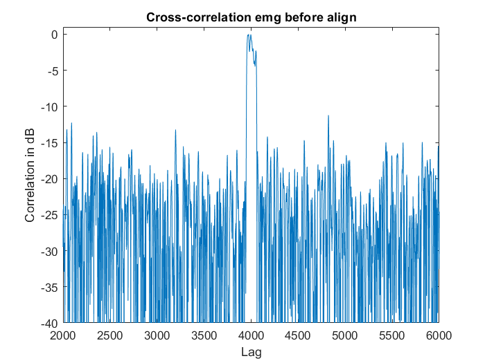
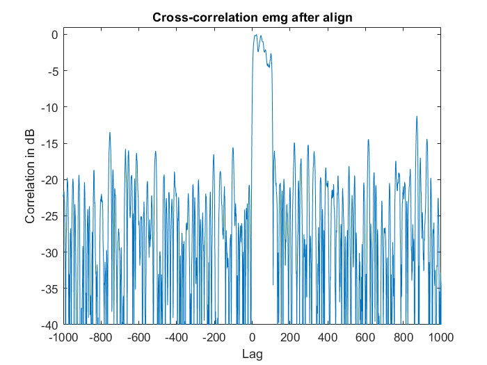
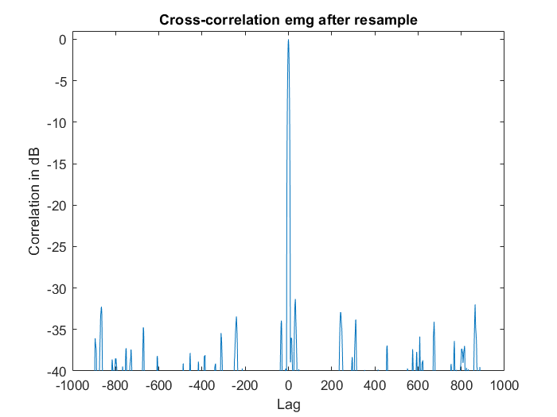

# Portfolio

This is our portfolio for the lab of 6-Digital Signal Proccessing cource on University of Antwerp.

Our project was to synchronize different sensor systems based on a commonly used synchronization channel. 
There was 1 problem with the EMG data because it was designed to be sampled on 1kHz but this was not the case. This "wrong" sample rate is fixed in our code.
We also had to visualize the EMG data in a readable mannor by using filters to make shure the data displayed has meaning to the end user.

## Table of contents
- [Documentation code](##Documentation-code)
    - [Wrong EMG signal sample frequency](###Wrong-EMG-signal-sample-frequency)
    - [Aligning the data based on the pseudo random signal](###Aligning-the-data-based-on-the-pseudo-random-signal)
    - [EMG data smoother](###EMG-data-smoother)
- [Who did what](##Who-did-what)

## Documentation code

In this chapter, we describe what we did to resample, synchronize and display the data. We use a global description of the steps we did. If you want further deepening, please see the code base.

### Wrong EMG signal sample frequency.

In the given dataset, the EMG signal was sampled at 1kHz. But in practice this sample rate was not 1kHz.

We can observe from the correlation graph below that the EMG signals correlates on to many places with the pseudo random sync signal.

We came up with a way to extract the correct sample frequency from the EMG signal based on the base signal. These are the steps we took:
1. We resample the signals to 1kHz
2. Match the beginning of the 2 signals and cut everything before off. So we make the signals causale.
3. Do the same at the end of the signal where we cut off everything that comes after this.

> In both 2 and 3 we work with a frame size (of 5000) so the correlation is less computationally heavy because 
when we correlate a signal with 20000 points, this gives us 40000 points to process. We took 5000 because the lagg was situated around 4000 samples difference with the base signal.

Below, the cross correlation where we see that the start of the correlation is at 0. This means that the signal is aligned at the beginning but still has a spread out signal.

4. The signals now start and stop at the same place. Because EMG is sampled at a different rate then the base signal, 
means that the EMG signal can have more points (sampled at a higher rate then 1kHz) or less points (sampled at a lower rate then 1kHz).

> from the used dataset, the EMG samples where lower in number then the base samples. This means that the EMG signal is sampled at a lower rate then 1kHz.

5. Based on this points, we can create the resample factor by dividing the amount of samples of the EMG by the amount of samples of the base signal.
We use the matklab <code>rat()</code> function to give us 2 integer numbers for the interpolation and decimation. 

> We can also multiply this ratio with the current base sample rate on 1kHz to get the real 
sample frequency of the EMG signal. In our case, we came up with a sample rate of 999.355039Hz

6. We check once more the full correlation of the EMG signal with the bas.

As can be observed, all the noise arround is gone and we have a single point of correlation which means the sample rates are equal.

### Aligning the data based on the pseudo random signal

When we found each sample frequency, we can continue with resampling the signals to 1kHz.

The steps we've taken:

1. Resample everything from the beginning with the new accuired sample rate to 1khz.

2. Align all signals (this is for the base signal, perfusion, EMG and video capture) so that they start at 1 position in time (causale). To align, we do not alter the base sync signal. So if a signal starts behind the sync signal, we add zeros to the orther signal. If a signal start upfront, we delete samples of the other signal until the match is there.

3. From this align method, we receive a lag value. This lag value is used to determine the beginning of all signals. So the maximum is used here. We cut everything off before the beginning to make the signals (and data) start at the same time.

4. When aligned propperly, we seek for the lowes number of samples in the 4 signals and cut everything off at the lowes number of samples. With this, we make sure that our signals start and stop at the same sample and are equal in length.

When observing a portion of the synchronization values, we see that they are aligned.

### EMG data smoother (or filter)

## Who did what
### Berkay
- GUI
### Tom
- Data extraction
- EMG smoother
### Robbe
- sync resampling
- Data aligning